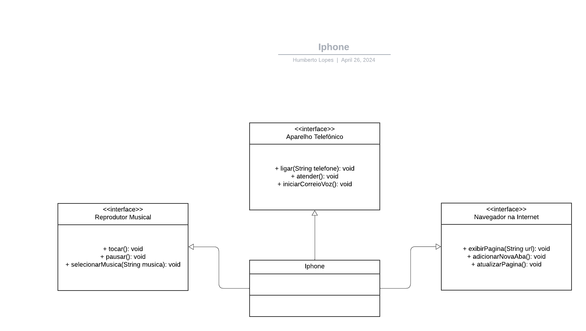

# Iphone Project

## Diagrama

Aqui está o diagrama utilizado no projeto:

## Descrição

Este projeto é uma aplicação de modelagem de um iPhone. Ele inclui as seguintes funcionalidades:

- Tela inicial com ícones de aplicativos
- Aplicativos pré-instalados, como câmera, galeria de fotos, navegador, etc.
- Possibilidade de adicionar e remover aplicativos
- Suporte a notificações e mensagens
